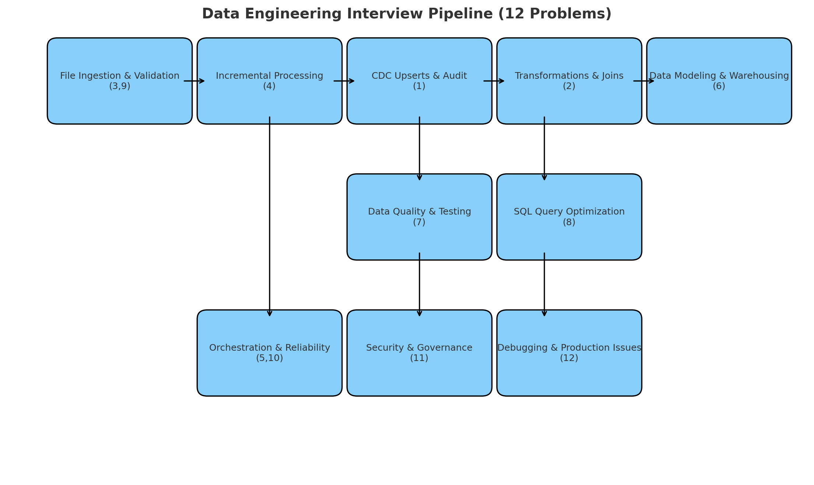

# Data Engineering Interview Playbook (12 Problems)

[]()
[]()
[]()

> Compact, practical, and interview-focused library of 12 data-engineering problems (Bronze→Silver→Gold pipeline). Each problem includes: problem statement, baseline approach, code snippets (PySpark/SQL), follow-up Q&A, and a one-page cheat sheet.
---
## Pipeline Map



---

## Why this repo
- Fast review before interviews (10-min flashcard sheet + deep-dive packs).  
- Hands-on notebook templates runnable on Databricks / local PySpark.  
- Production-minded patterns: idempotency, observability, security, orchestration.  
- Easy to extend as you learn or encounter new patterns.

---

## Quick start

1. Clone the repo:
```bash
git clone https://github.com/parth30034/Data-Engineering-Interview-Playbook.git
cd Data-Engineering-Interview-Playbook
